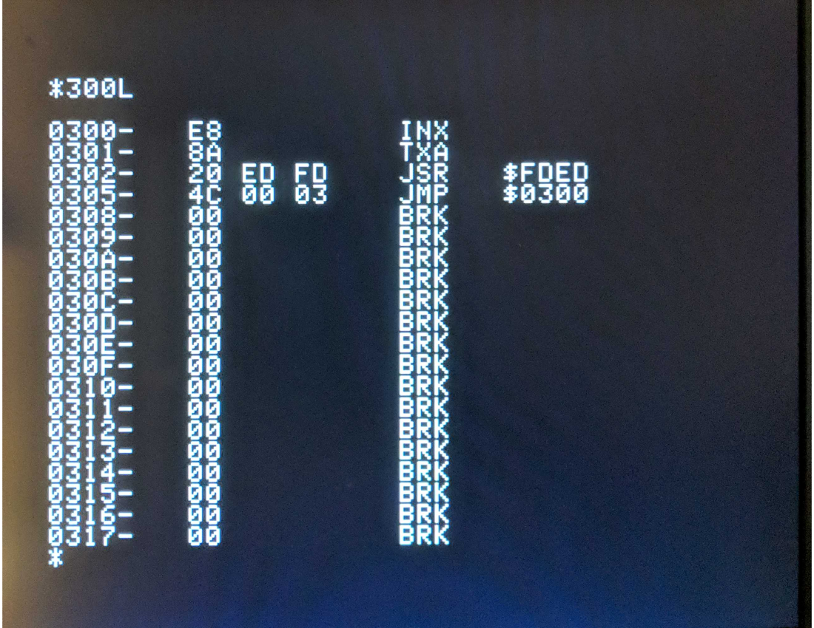

# computer_8bit
Implementation of a popular 8-bit computer on a Cyclone IV based DE2-115
 

The monitor on the left is my Linux workstation, it's the one on the right thats more interesting  
This is an early implementation of my video subsystem, I cheated and used duel ported BRAM, the real deal kicked the CPU off the bus; thus, the 6502 was in a kind of wait state except during blanking. Yep that's VGA! (I don't have any composite monitors anymore) VGA was hard enough but I so wanna sort out HDMI  

Text mode works
 

The ROMs are "programmed" during synthesis (I'm not using external flash etc.). I used xxd to format the file:
`xxd -ps -c1 3410036.bin > AppleII_crom.txt` The roms can be dumped from your Apple II or downloaded from http://ftp.apple.asimov.net/emulators/rom_images/ 

The CROM (character ROM) begins with 00 1c 22 2a 2e 2c 20 1e... Look for a file named `3410036.bin` The file contains bitmaps of the character set.
<pre>
0x00   
0x1c      XXX  
0x22     X   X 
0x2a     X X  X
0x2e     X XX X
0x2c     X XX
0x20     X
0x1e      XXXX
</pre>

For the main ROM `APPLE2_.ROM` from `https://ftp.apple.asimov.net/emulators/rom_images/` might be a good choice. 
